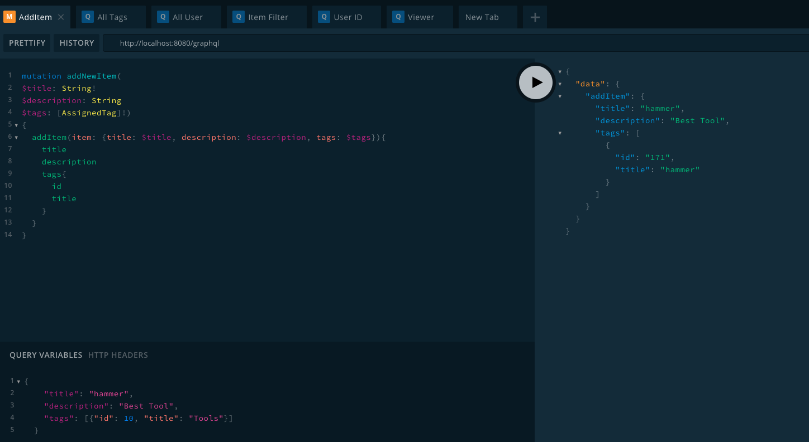

# Boomtown 🏙
Boomtown is a Web App to share and borrow itens online.
Each user can have a list of items that can be borrowed by other users, as can borrow items from another users.

---

## Server

Commands must be run from the `server` directory:

### Installation

```bash
yarn install
```

### Run

```bash
yarn start: dev
```
--- 
## Client

Commands must be run from the `client` directory:

### Installation

```bash
yarn install
```

### Run

```bash
yarn start
```

### Build

```bash
yarn run build
```

---
## Technology involved
* Git/Github
* Node
* Express
* Javascript/JSX
* React/ React Router
* Material-UI
* PostgreSQL
* Apollo Server
* GraphQL

---
## Personal learnings
How to work with Database, the relationship between client, server and Database.

Understand better how this relation bellow works.


---
## Playground
Where all your queries and mutations can be tested before using in your react app, in the server folder.

## Screenshot from Playground


## Author

Alex Faissal 
[My LinkedIn](https://www.linkedin.com/in/alex-faissal/)