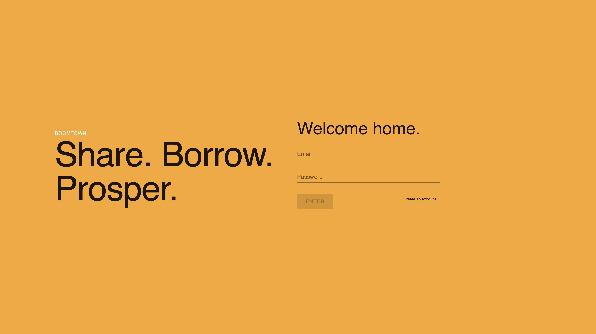
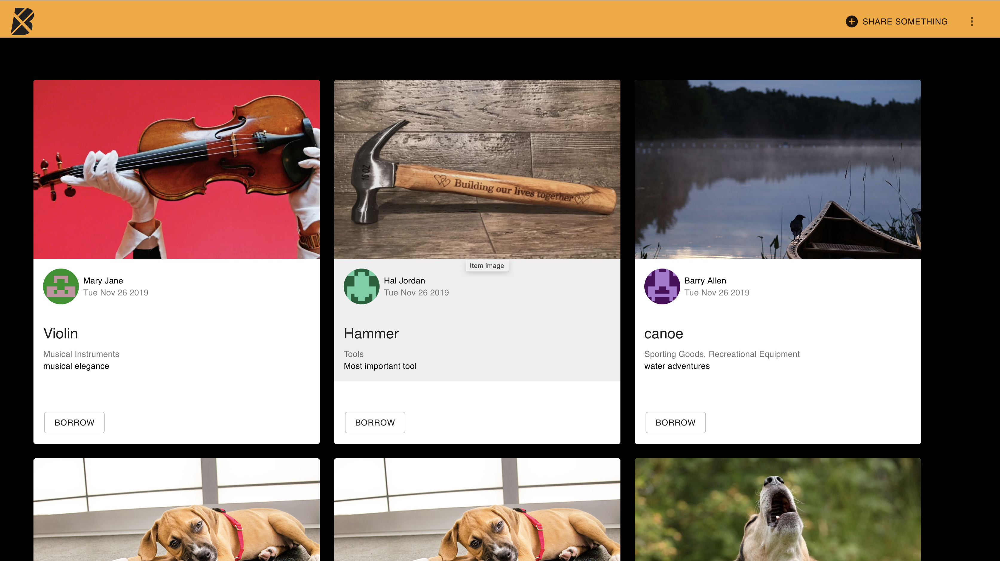
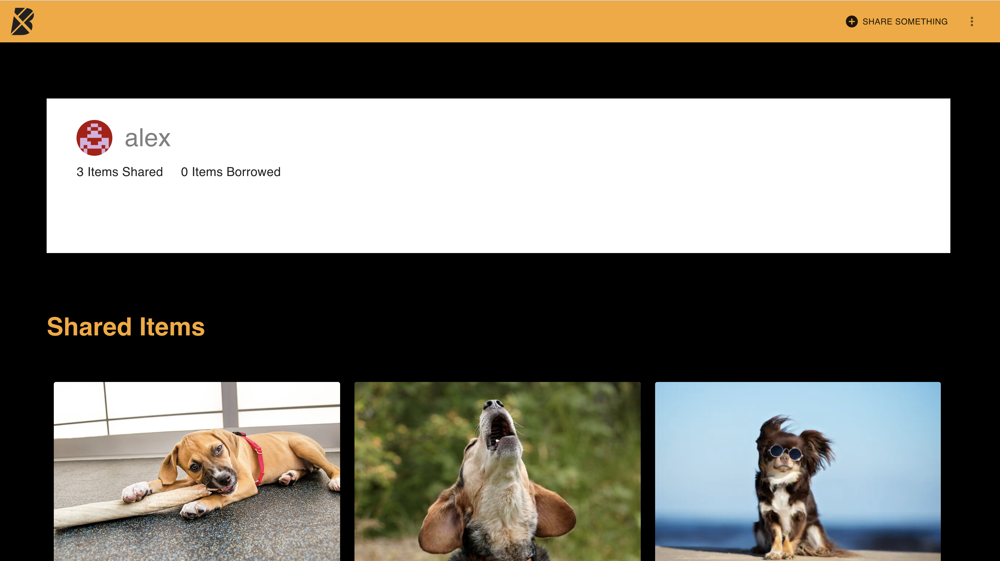
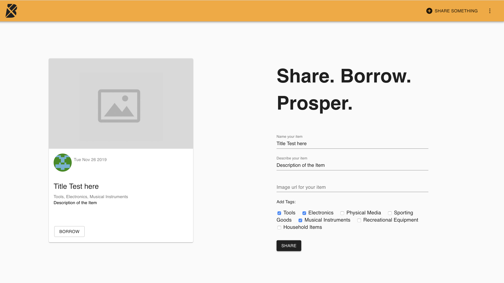

# Boomtown 🏙

Boomtown is a Web App to share and borrow itens online.
Each user can have a list of items that can be borrowed by other users, as can borrow items from another users.

---

## Screenshot from Client Side

##  

##  

## Screenshot from GraphQl's Playground

## 

## Description

Boomtown is a React build app using Graphql Database to simulate a share items application. There is login, logout, profile and different user that interact with each other to share and borrow different items from one another.

## Instalation and run instruction

## Server

Commands must be run from the `server` directory in Terminal:

### Installation

```bash
yarn install
```

### Run

```bash
yarn start:dev
```

---

## Client

Commands must be run from the `client` directory in Temrinal:

### Installation

```bash
yarn install
```

### Run

```bash
yarn start
```

### Build

```bash
yarn run build
```

---

## Technology involved

- Node
- Express
- React
- React Router
- Material-UI
- PostgreSQL
- Apollo Server
- GraphQL

---

## Personal learnings

How to work with Database, the relationship between client, server and Database.

Understand better how this relation bellow works.


---

## Playground

Where all your queries and mutations can be tested before using in your react app, in the server folder.

## Author

Alex Faissal
[LinkedIn](https://www.linkedin.com/in/alex-faissal/)
